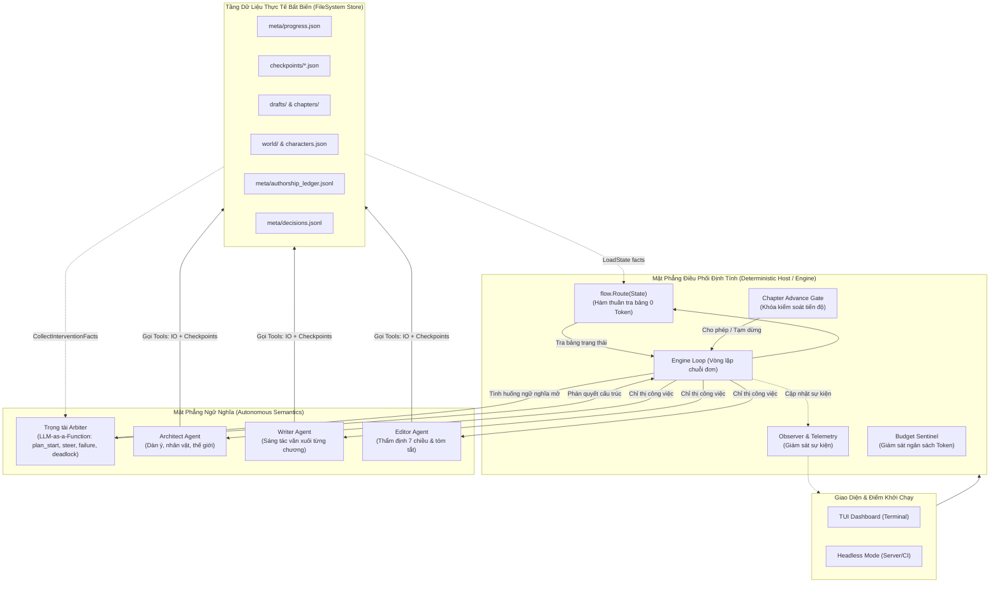
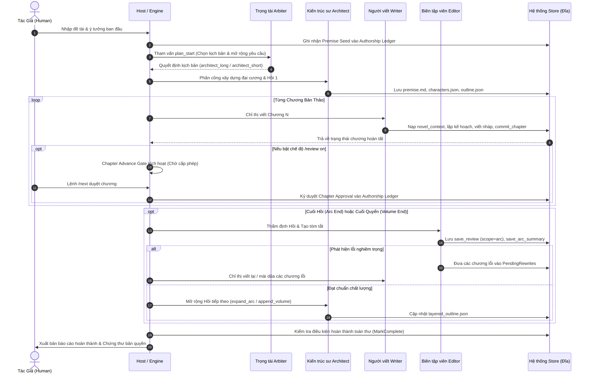
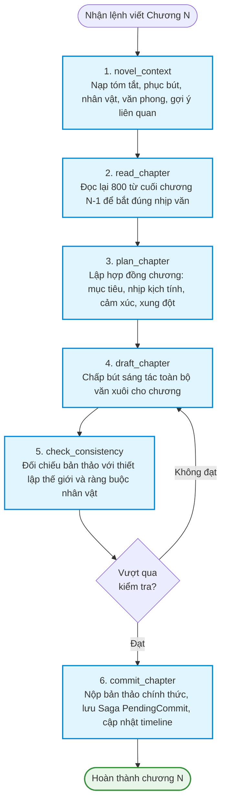
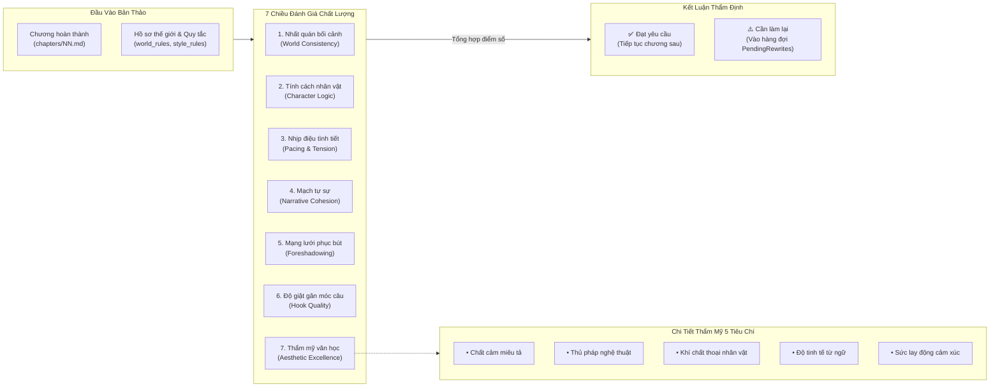
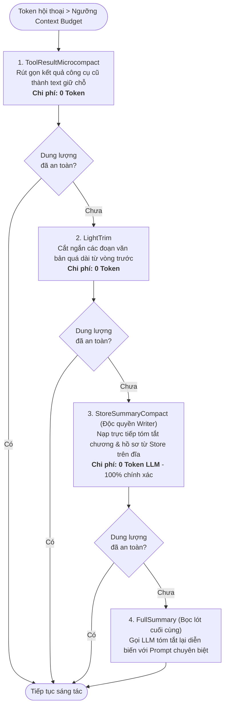
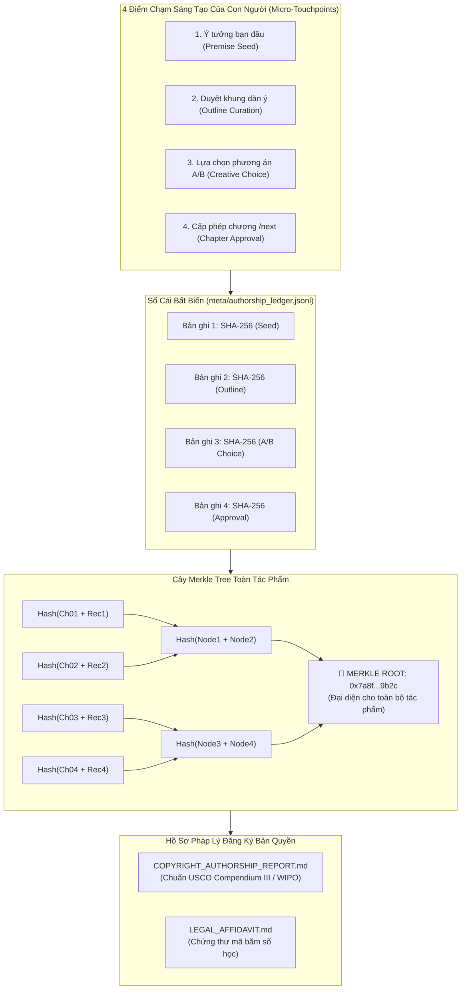
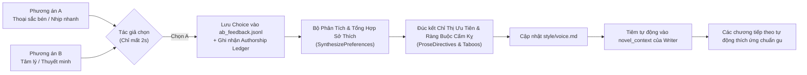
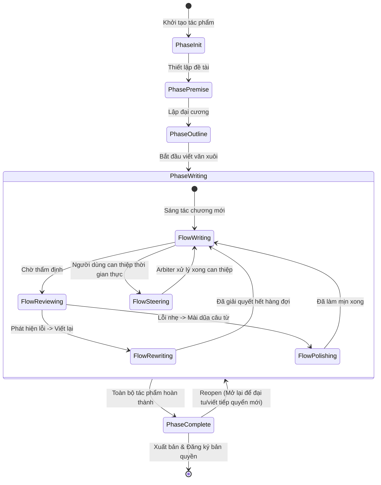

# Tổng Hợp Sơ Đồ Hệ Thống & Đường Ống Kiến Trúc (Architecture & Pipeline Diagrams)

Tài liệu này tổng hợp toàn bộ các sơ đồ **Mermaid** trực quan hóa kiến trúc, quy trình sáng tác, máy trạng thái, đường ống nén ngữ cảnh và cơ chế sở hữu trí tuệ của `ainovel-cli`.

---

## 1. Kiến Trúc Tổng Thể Hai Mặt Phẳng (Dual-Plane Runtime Architecture)

Sự phân tách giữa **Mặt Phẳng Trạng Thái Định Tính (Deterministic Engine Plane)** và **Mặt Phẳng Ngữ Nghĩa Tự Chủ (Autonomous Semantics Plane)**.

---

## 2. Quy Trình Sáng Tác Toàn Vòng Đời (End-to-End Novel Lifecycle)

Quy trình từ ý tưởng ban đầu đến tác phẩm hoàn chỉnh hàng trăm chương.

---

## 3. Đường Ống 6 Bước Chấp Bút Mỗi Chương Của Writer (Writer 6-Step Pipeline)

Mỗi chương được tác tử Writer tự chủ thực hiện qua 6 bước nghiêm ngặt kèm điểm kiểm soát Checkpoint.

---

## 4. Đường Ống Thẩm Định 7 Chiều Của Editor (Editor 7-Dimensional Quality Gate)

Editor thẩm định bản thảo trên 2 tầng: **Cấu trúc tình tiết** và **Thẩm mỹ văn học**.

---

## 5. Cơ Chế Quản Lý Ngữ Cảnh & Nén Zero-LLM (Adaptive Context Pipeline)

Quy trình nén ngữ cảnh tự động từ chi phí thấp đến cao khi dung lượng token vượt ngưỡng an toàn.

---

## 6. Cơ Chế Human-In-The-Loop & Sổ Cái Quyền Tác Giả Merkle Tree

Mô hình "Tối thiểu thao tác - Tối đa bằng chứng bản quyền" và cây Merkle Root.

---

## 7. Vòng Lặp Phản Hồi Lời Nhắc A/B (A/B Selection & Prompt Feedback Loop)

Quy trình tự động học gu thẩm mỹ của tác giả và tiêm trực tiếp vào Lời nhắc Hệ thống.

---

## 8. Máy Trạng Thái Toàn Hệ Thống (State Machine Transitions)

Các giai đoạn sáng tác (`Phase`) và luồng vận hành (`Flow State`).

